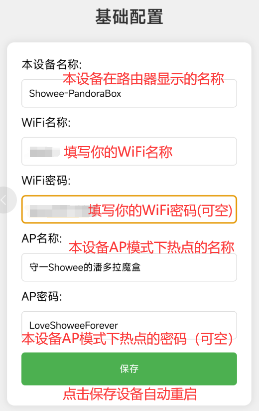
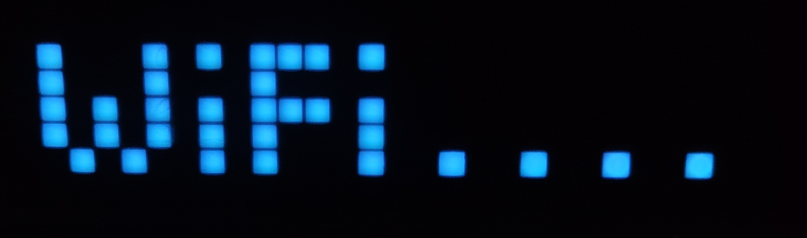
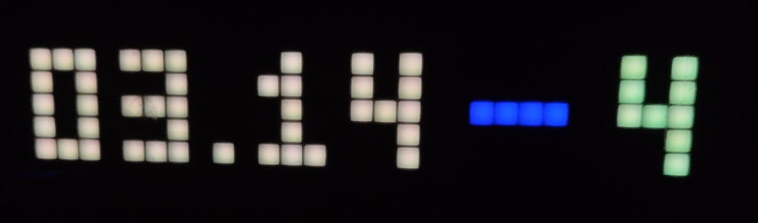
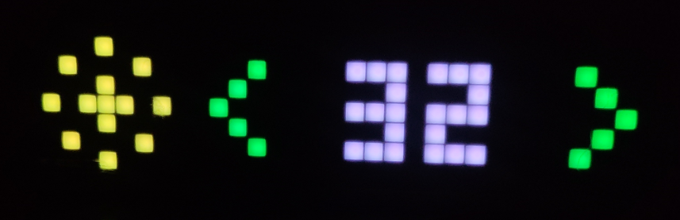

开发环境:CLion+PlatformIO

开发平台:espressif32

框架:arduino

```
[env:denky32]
platform = espressif32
board = denky32
framework = arduino
monitor_speed = 115200
upload_speed = 921600
lib_deps =
    ArduinoJson
    FastLED
```

## 使用说明

1. 第一开机,因为没有保存WiFi信息,会进入AP模式,如图
   
2. 此时可以通过手机或电脑连接本设备提供的WiFi热点,默认名称:守一Showee的潘多拉魔盒,密码:LoveShoweeForever
3. 连接成功后,手机或电脑会自动跳转到配置页面,如图
   
4. 首先进入基础配置页面,填写可用的WiFi名称和密码(只接受2.4GHz),点击保存
   
   
5. 保存成功后,设备会自动重启,进入WiFi连接状态,如图
   
6. 如果设备一直处于WiFi连接状态,可能是之前输入的WiFi信息有误,此时需同时长按设备顶部的左右按钮来进入AP模式
7. 需要注意的一点是,同时长按顶部左右两侧按钮时，需要先按左侧的按钮，再按右侧的按钮，否则无法进入AP模式
8. 成功连接到WiFi后,设备会进入APP显示状态,可以通过点击顶部左右按钮切换不同APP的显示
9. 联网成功后,如果想设置每个APP的参数,可以通过局域网在浏览器内直接访问本设备的IP,进入不同的APP设置页面
10. 本设备的IP地址可以通过串口监视器查看,也可以通过路由器的设备列表查看

## 重要操作

1. 长按顶部左右两侧按钮(需要先按下👈左侧按钮)进入AP模式,再次长按,设备将重启
2. 长按顶部左右两侧按钮(需要先按下👉右侧按钮)强制进入APP显示模式(适用于AP模式下不知道密码且法连接WiFi的情况)
3. 正常联网状态下,无法进入强制显示APP的模式,因为联网状态下,设备本身就处于APP显示模式
4. 一直连接WiFi或AP模式的情况下可以强制进入APP显示模式,再次长按将返回原模式
5. 长按顶部中间按钮会熄屏,再次长按会亮屏
6. 短按顶部左右按钮会在APP间切换
7. 短按顶部中间按钮会在APP内切换(如果此APP有内外之分)

## APP功能

1. B站粉丝数显示
   
2. 时间显示
   
3. 时间显示时按下顶部中间按钮,会显示日期和星期
   
4. 亮度调节,切换到此APP后,按下顶部中间按钮,进入调节模式,通过左右按钮调节亮度(2~32)
   
   
5. 数字雨
   
6. 重置设备功能(重要！),在数字雨APP下,按下顶部中间按钮,进入reset页面
   
7. 通过左右按钮将红色感叹号全部变为绿色,设备会清除所有已保存的配置,然后自动重启(适用于无法联网且忘记AP密码的情况)
   
